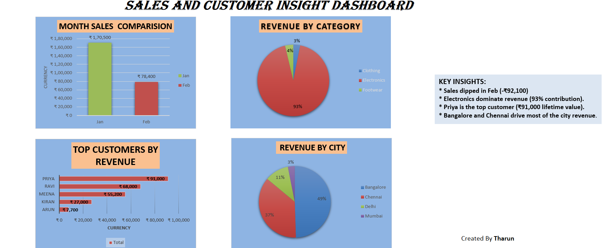

#  Sales and Customer Insight Dashboard

## Project Overview
This project analyzes sales performance and customer insights using SQL and dashboard visualization techniques. The dashboard highlights revenue trends, top customers, category contribution, and city-wise revenue distribution.

## Tools Used
- SQL
- Excel

## Dashboard Features
- Monthly Sales Comparison
- Revenue by Category
- Top Customers Analysis
- City-wise Revenue Distribution
- Business Insights Section

## Key Insights
- Electronics category generated the highest revenue.
- Priya was the top customer by lifetime value.
- Bangalore and Chennai contributed major city revenue.
- Sales decreased in February compared to January.

## Files Included
- dataset.xlsm
- sales_customer_dashboard.png

## Dashboard Screenshot

